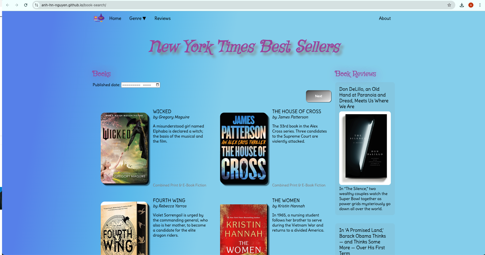
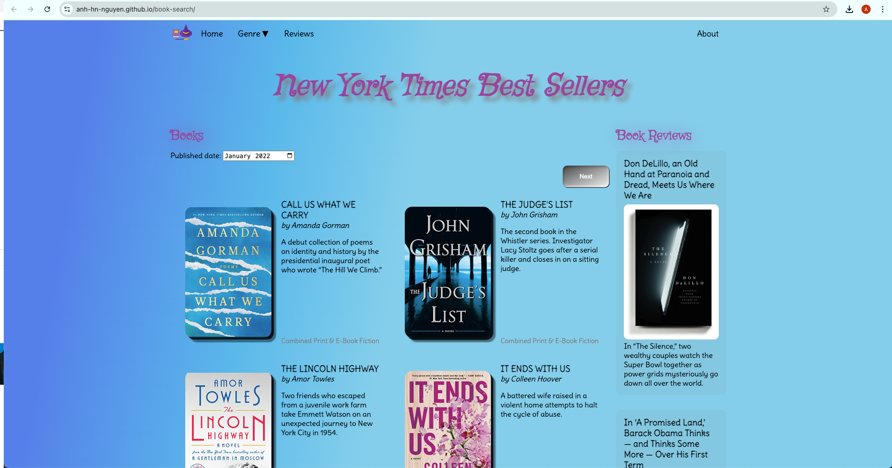
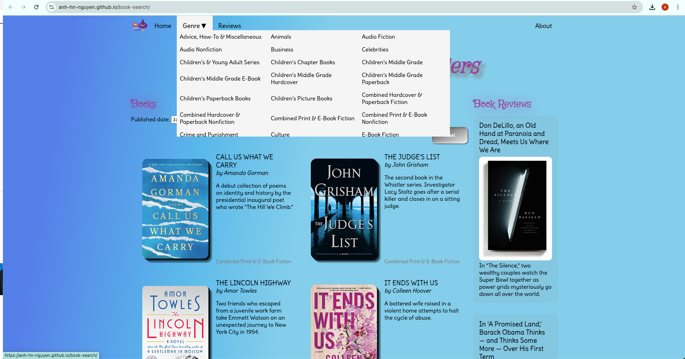
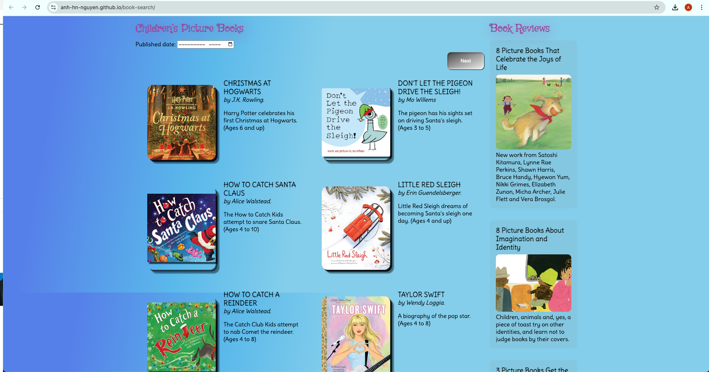

# New York Times Best Seller Shelf

## What does the app do?

The Shelf allows users to search for New York Times Best Sellers across 100 genres and dates, coupled with verified book reviews

## Sample

1. Current Best Sellers accross different genres

2. Best Sellers filtered by published date

3. Choose a specific genre

4. Best Sellers by Children's books genre

## Limitation
- NYT API Search limit quota
- Exposed API key

## Upcoming changes
- Hidden API key
- Search NYT book reviews by book title, author name, etc.